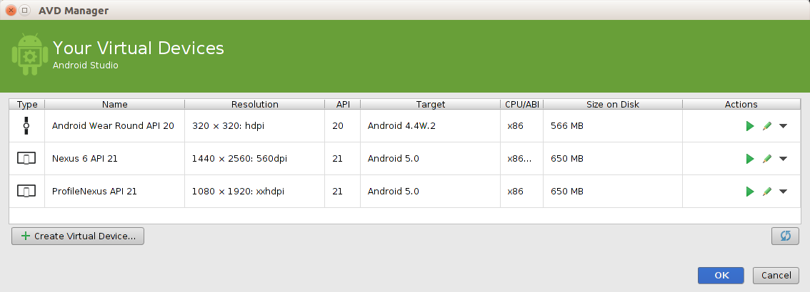

# 执行Android程序

> 编写:[yuanfentiank789](https://github.com/yuanfentiank789) - 原文:<http://developer.android.com/training/basics/firstapp/running-app.html>

通过[上一节课](creating-project.html)创建了一个Android的Hello World项目，项目默认包含一系列源文件，它让您可以立即运行的应用程序。

如何运行Android应用取决于两件事情：你是否有一个Android设备和你是否正在使用Android Studio开发程序。本节课将会教使用Android Studio和命令行两种方式在真实的android设备或者android模拟器上安装并且运行你的应用。


## 在真实设备上运行

如果你有一个真实的Android设备，以下的步骤可以使你在你的设备上安装和运行你的应用程序：

### 手机设置

1. 把你的设备用USB线连接到计算机上。如果你是在windows系统上进行开发的，你可能还需要安装你设备对应的USB驱动，详见[OEM USB Drivers](http://developer.android.com/tools/extras/oem-usb.html) 文档。
2. 开启设备上的**USB调试**选项。
<ul>

<li>  在大部分运行Andriod3.2或更老版本系统的设备上，这个选项位于“**设置**>**应用程序**>**开发选项**”里。</li>
<li> 在Andriod 4.0或更新版本中，这个选项在“**设置**>**开发人员选项**”里。</li>
</ul>
   **Note:** 从Android4.2开始，**开发人员选项**在默认情况下是隐藏的，想让它可见，可以去**设置>关于手机（或者关于设备)**点击**版本号**七次。再返回就能找到**开发人员选项**了。

### 用Android Studio在运行程序

1. 选择项目的一个文件，点击工具栏里的**Run**按钮。

2. **Choose Device**窗口出现时，选择**Choose a running device**单选框，点击**OK**。

Android Studio 会把应用程序安装到你的设备中并启动应用程序。

### 从命令行安装运行你的应用程序

命令行切换当前目录到Andriod项目的根目录，在debug模式下使用Gradle编译项目，使用gradle脚本执行assembleDebug编译项目，执行后会在build/目录下生成MyFirstApp-debug.apk。

Windows操作系统下，执行：

```
gradlew.bat assembleDebug
```

Mac OS或Linux系统下：

```
$ chmod +x gradlew
$ ./gradlew assembleDebug
```

编译完成后在app/build/outputs/apk/目录生成apk。
**Note:** chmod命令是给gradlew增加执行权限，只需要执行一次。

确保 Android SDK里的 `platform-tools/` 路径已经添加到环境变量的`PATH`中，执行：

```
adb install bin/MyFirstApp-debug.apk
```

在你的Android设备中找到 MyFirstActivity，点击打开。


## 在模拟器上运行

无论你是用 Android Studio 还是命令行，在模拟器中运行程序首先要创建一个 [Android Virtual Device](http://developer.android.com/tools/devices/index.html) (AVD)。AVD 是对 Android 模拟器的配置，可以让你模拟不同的设备。


###创建一个 AVD:
1. 启动 Android Virtual Device Manager（AVD Manager）的两种方式：
<ul>
  <li>用Android Studio, **Tools > Android > AVD Manager**,或者点击工具栏里面Android Virtual Device Manager  ；
  <li> 在命令行窗口中，把当前目录切换到`<sdk>/tools/` 后执行：
</ul>
```
android avd
```



2  在AVD Manager 面板中，点击**Create Virtual Device**.


3  在Select Hardware窗口，选择一个设备，比如 Nexus 6，点击**Next**。

4  选择列出的合适系统镜像.

5 校验模拟器配置，点击**Finish**。

更多AVD的知识请阅读[Managing AVDs with AVD Manager](http://developer.android.com/tools/devices/managing-avds.html).

### 用Android Studio在运行程序：

1 在Android Studio选择要运行的项目，从工具栏选择**Run**；

2 **Choose Device**窗口出现时，选择**Launch emulator**单选框；

3 从** Android virtual device**下拉菜单选择创建好的模拟器，点击**OK**；

模拟器启动需要几分钟的时间，启动完成后，解锁即可看到程序已经运行到模拟器屏幕上了。

### 从命令行安装运行你的应用程序

1 用命令行编译应用，生成位于app/build/outputs/apk/的apk；

2 确认platform-tools/ 已添加到PATH环境变量；

3 执行如下命令：

```
adb install app/build/outputs/MyFirstApp-debug.apk
```
4 在模拟器上找到MyFirstApp，并运行。


以上就是创建并在设备上运行一个应用的全部过程！想要开始开发，点击[next lesson](building-ui.html)。
